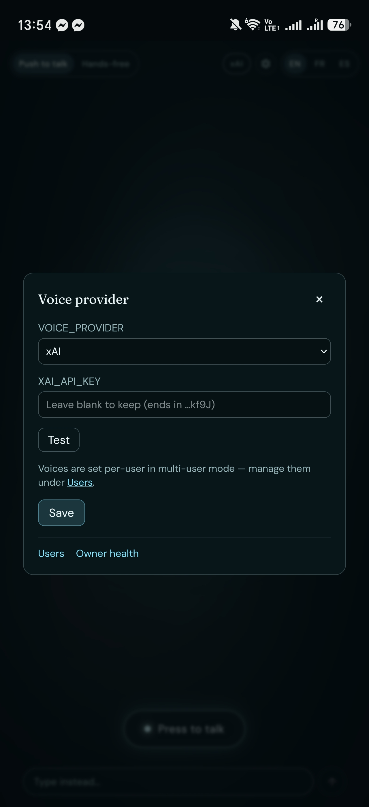
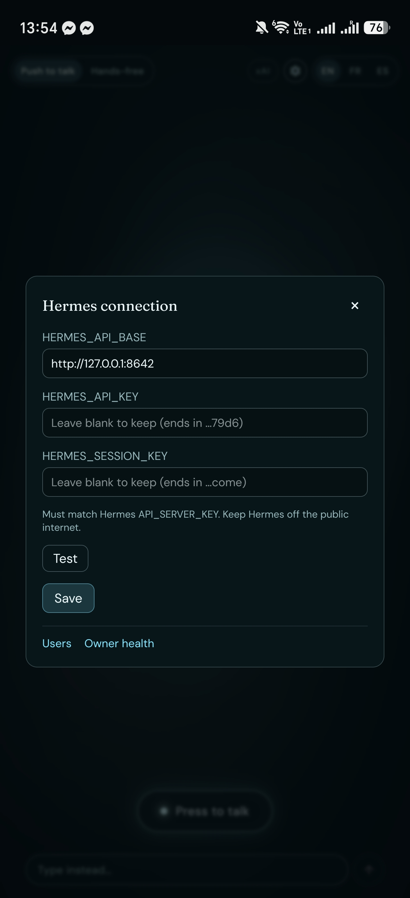
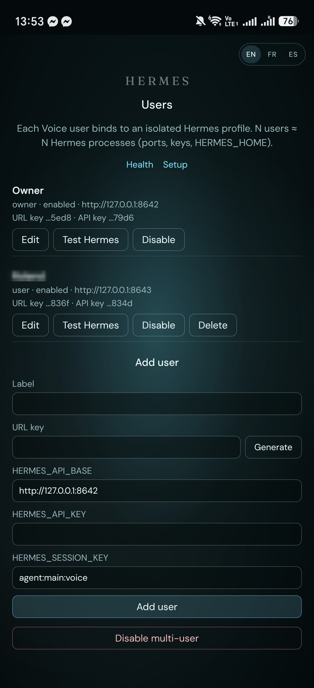
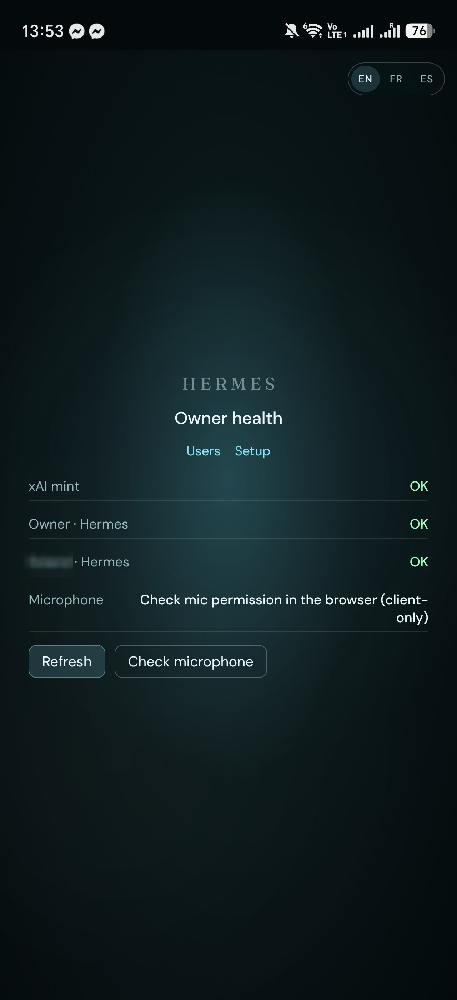

<h1>
  
  Hermes Voice
</h1>

Private **realtime voice** web UI for [Hermes Agent](https://github.com/NousResearch/hermes-agent) — a thin layer that talks through a realtime speech provider and delegates tool-heavy work to your Hermes instance.

- **Lounge** — press-to-talk (default) or hands-free (server VAD), or type instead; mic + playback visualizer
- **Providers** — [xAI](https://x.ai/) realtime (default) or [OpenAI](https://openai.com/) Realtime via `VOICE_PROVIDER`
- **Voice choice** — per-binding voice in multi-user mode (`/owner/users`), or a single owner-editable default in single-user mode; xAI's list is fetched live from its voice catalog, OpenAI's is a small curated list — never a mid-call hot-swap, and a bad pick degrades to the provider default instead of failing
- **In-app settings** — an owner-only pill (provider) and gear icon in the Lounge open a settings modal for provider/keys/voice or the Hermes connection, no `/setup` round-trip needed for routine changes
- **Hermes bridge** — email, calendar, contacts, and other tool work via `ask_hermes` → your Hermes API
- **Auth** — URL key gate (`?k=`); optional multi-user with one Hermes **profile** per Voice user
- **Persona** — per-binding assistant name, address style, pacing, auto-greet-on-connect, and voice; editable from `/owner/users`, not just hand-edited into `data/bindings.json`
- **Memory review** — opt-in per binding: capture both sides of a hands-free conversation and hand the transcript to that user's own Hermes profile for a dedicated memory-extraction pass, instead of relying on incidental per-turn tool-calling
- **i18n** — UI locales `en` / `fr` / `es` (detect + manual override)
- **Setup** — optional WebUI wizard (`SETUP_TOKEN`) + owner health / user admin + owner-triggered self-restart (`ALLOW_SELF_RESTART`, opt-in, off by default)

Bring your own provider key and Hermes instance.

## Screenshots

<p align="center">
  
  &nbsp;&nbsp;
  
  &nbsp;&nbsp;
  
</p>

<p align="center">
  
  &nbsp;&nbsp;
  
  &nbsp;&nbsp;
  
</p>

<p align="center">
  <em>Top:</em> Lounge at rest with the settings pill/gear · live session · provider settings.
  <em>Bottom:</em> Hermes connection settings · multi-user admin · owner health.
</p>

## License

[PolyForm Noncommercial 1.0.0](./LICENSE) — free for personal / non-commercial use.  
Commercial use requires a separate license from the author.

## Requirements

- Node.js 20+ (24 recommended)
- An [xAI](https://x.ai/) API key with realtime / voice access (default), **or** an [OpenAI](https://openai.com/) API key when `VOICE_PROVIDER=openai`
- A running [Hermes Agent](https://github.com/NousResearch/hermes-agent) with its OpenAI-compatible API enabled (typically `http://127.0.0.1:8642`)
- HTTPS in production (browser mic + secure cookies)

## Quick start (dev)

```bash
git clone https://github.com/Cosmekaili-creator/Hermes-Voice.git
cd Hermes-Voice
npm ci
cp .env.example .env
# Edit .env — at least VOICE_URL_KEY and XAI_API_KEY (or OPENAI_API_KEY + VOICE_PROVIDER=openai);
# Hermes vars for tool turns
npm run dev
```

Open `http://localhost:5173/?k=<your VOICE_URL_KEY>`.

### First-run setup (optional)

Instead of hand-editing every secret, set a random `SETUP_TOKEN` in `.env` (leave `SETUP_COMPLETE` unset), start the app, open `/setup?token=…`, complete the wizard, restart, then use `/?k=…`. Manual `.env` editing remains fully supported. Details: [docs/CONFIGURATION.md](docs/CONFIGURATION.md).

```bash
npm run check
npm run build
npm run preview -- --host 127.0.0.1 --port 4342
```

## Configure

Full env reference: [docs/CONFIGURATION.md](docs/CONFIGURATION.md).

Minimal `.env`:

```bash
VOICE_URL_KEY=long-random-string
XAI_API_KEY=xai-...
# Optional OpenAI instead of xAI:
# VOICE_PROVIDER=openai
# OPENAI_API_KEY=sk-...
HERMES_API_BASE=http://127.0.0.1:8642
HERMES_API_KEY=same-as-hermes-API_SERVER_KEY
HERMES_SESSION_KEY=agent:main:voice
```

### Voice providers

| Provider          | Env                                        | Defaults                               |
| ----------------- | ------------------------------------------ | -------------------------------------- |
| **xAI** (default) | `XAI_API_KEY`                              | model `grok-voice-latest`, voice `eve` |
| **OpenAI**        | `VOICE_PROVIDER=openai` + `OPENAI_API_KEY` | model `gpt-realtime`, voice `alloy`    |

Optional OpenAI overrides: `OPENAI_REALTIME_MODEL`, `OPENAI_VOICE` (resolved on the server; returned non-secret on `POST /api/session`). The setup wizard stays xAI-first — OpenAI is an ops env switch. Multi-user shares the active provider key for the whole process; provider/key/voice defaults can also be changed live from the Lounge's settings modal (owner-only), no `/setup` visit required.

**Voice choice**: each multi-user binding can pick its own realtime voice from `/owner/users` (`voiceId`, defaults to the provider default when unset). xAI's voice list is fetched live from its voice catalog with an explicit "Load voices" action; OpenAI's is a small hardcoded list (`marin`/`cedar` recommended) since no such API exists there. A voice change only applies to the *next* session — never a mid-call hot-swap — and a rejected/invalid pick falls back to the provider default rather than breaking the session. In single-user mode the same picker lives in the settings modal's provider section instead.

Adapter seam: `src/lib/providers/` (capability matrix, mint, xAI WebSocket + OpenAI WebRTC clients).

### Connect Hermes

1. Enable Hermes’s API server (`API_SERVER_ENABLED`, `API_SERVER_KEY`, loopback bind).
2. Set this app’s `HERMES_API_KEY` to the same secret.
3. Keep Hermes’s API **off the public internet** — only this Node process should call it.
4. `POST /api/hermes` from the voice UI forwards tool requests; the browser never talks to Hermes directly.

### Multi-user (optional)

Default is single-user (one `VOICE_URL_KEY` + one Hermes trio in `.env`).

With `MULTI_USER=1`, each Voice user binds to an isolated Hermes profile (own API base/key). Enable and manage users — including their persona and voice — at `/owner/users`; readiness at `/owner/health`.

**Ops cost:** N Voice users ≈ N Hermes profile processes (ports, keys, `HERMES_HOME`). Do not hide that cost. Runbook: [docs/OPS.md](docs/OPS.md).

Each binding can also carry its own persona (custom assistant name, address style, pacing, hands-free timing, auto-greet) and, opt-in per binding, **conversation memory review**: when a hands-free conversation explicitly ends, the accumulated transcript of both sides is sent to that user's own Hermes profile with a fixed instruction to save anything worth remembering — a dedicated pass, rather than hoping a live tool call happens to catch it. Off by default; enabling it means that binding's raw speech is transcribed and persisted to memory, which changes the data posture for that user — see the privacy note in [docs/CONFIGURATION.md](docs/CONFIGURATION.md).

## Production

| Path                                                   | Role                                                         |
| ------------------------------------------------------ | ------------------------------------------------------------ |
| [deploy/](deploy/)                                     | systemd unit, nginx example, env template                    |
| [deploy/docker-compose.yml](deploy/docker-compose.yml) | Optional Voice Compose image (`network_mode: host` on Linux) |
| [docs/OPS.md](docs/OPS.md)                             | N-profile provisioning, Compose networking / SSRF allowlist  |

```bash
npm run build
# rsync build/ + prod node_modules to runtime (see deploy/README.md)
# set ORIGIN=https://your.domain
```

Health check: `GET /health` → `{"ok":true,"service":"hermes-voice"}`.

## How it works

```text
Browser ──mic──► Realtime provider (xAI WebSocket PCM, or OpenAI WebRTC)
   │                      │
   │         ask_hermes tool call
   ▼                      ▼
SvelteKit ──POST /api/hermes──► Hermes Agent (:8642 / per-user port)
   │
   └── mints ephemeral client secret (long-lived API key stays on server)
```

Talk modes: **push-to-talk** commits audio from the client; **hands-free** uses provider server VAD. A typed-text field is always available as a third input path — it injects straight into the live session as if spoken, so Hermes still replies in voice, on either provider. Locale switch affects UI strings and soft-hints voice instructions.

## Docs

| Doc                                            | Contents                                      |
| ---------------------------------------------- | --------------------------------------------- |
| [CHANGELOG.md](CHANGELOG.md)                   | Release notes                                 |
| [docs/CONFIGURATION.md](docs/CONFIGURATION.md) | Env vars, wizard, multi-user, providers       |
| [docs/OPS.md](docs/OPS.md)                     | N-profile ops, Compose, Hermes host allowlist |
| [deploy/README.md](deploy/README.md)           | systemd / nginx install recipe                |

## Intentional limits

- No per-Lounge-session **provider picker** — `VOICE_PROVIDER` is one process-wide choice for everyone, editable from the settings modal or `/setup`, but not per active call. Voice (not provider) *is* per-user in multi-user mode.
- No always-on listening without arming hands-free
- Hermes bases must pass the SSRF allowlist (loopback / private IPs / `*.local`) — Compose service DNS names are rejected; see [docs/OPS.md](docs/OPS.md)
- Wizard remains single-binding / xAI-first; OpenAI and multi-user are ops/admin after bootstrap
- Self-restart is a manual, owner-triggered action behind an explicit opt-in (`ALLOW_SELF_RESTART`) — not automatic, and not reachable from the browser unless a deployer turns it on

## Maintainer

Maintained by **[Majorum Network](https://www.majorum.net)**.

## Credits

Visualizer style adapted from the [David Lazic audio-visualizer](https://github.com/DavidLazic/audio-visualizer) ring approach.  
Hermes Agent by [Nous Research](https://github.com/NousResearch/hermes-agent).
